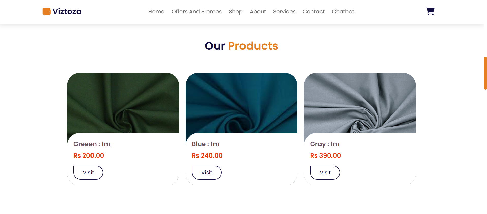
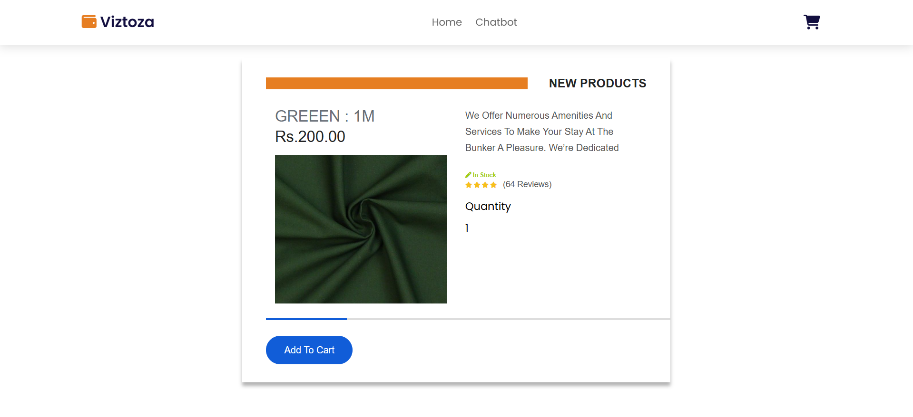
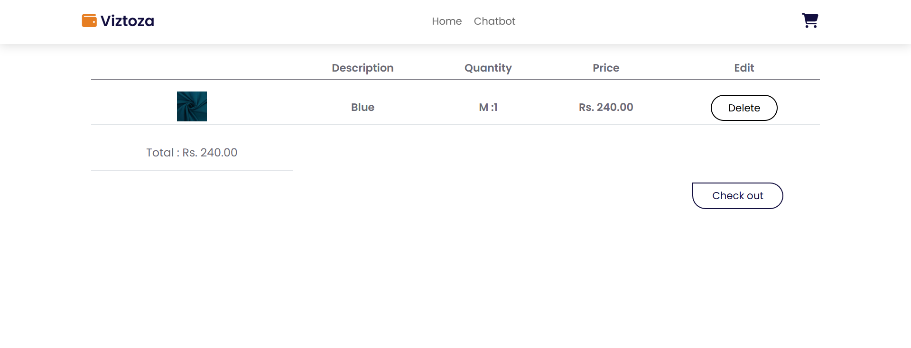
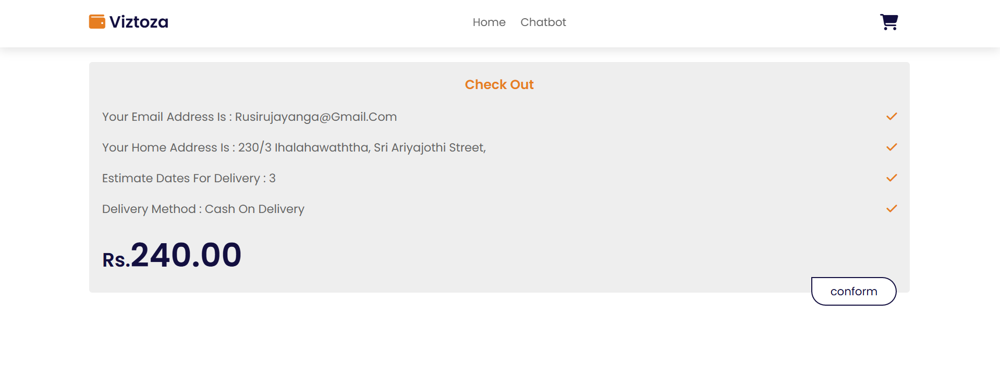

<h2 align="left">Fabric-store-web-application</h2> 

<h4 align="left">LANGUAGES AND TOOLS </h4>

 

 

This is an e-commerce web application developed for a fabric store using PHP, HTML, CSS, JavaScript, and MySQL. 
The main objective of this project is to gain hands-on experience in building PHP-based web applications, while implementing essential <b>CRUD operations, user authentication, and shopping functionalities

<h4 align="left">Key Features </h4>

<h5 align="left">Customer Features </h5>
<ul align="left">
  <li>Register/Login to the platform securely.</li>
  <li>View fabric details including images, descriptions, and prices.</li>
  <li>Add items to the shopping cart and manage quantities.</li>
  <li>Proceed to checkout and place orders.</li>
</ul>

<h5 align="left">Admin Features </h5>
<ul align="left">
  <li>Admin login with authentication.</li>
  <li>Add, edit, and delete fabric products.</li>
  <li>Manage product inventory and update pricing.</li>
  <li>View and track customer orders.</li>
</ul>

 

This project provides a solid foundation for understanding PHP-based e-commerce applications. 
It demonstrates concepts such as user authentication, database interaction, dynamic content generation.

 

 
 
 
 
 
 
 

